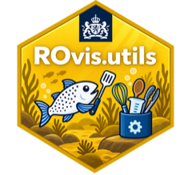

<!-- badges: start -->
[](https://github.com/rivm-syso/ROvis.utils/actions/workflows/ci.yaml)
[](https://github.com/rivm-syso/ROvis.utils/actions/workflows/ci.yaml)
[](https://github.com/rivm-syso/ROvis.utils/actions/workflows/ci.yaml)
<!-- badges: end -->

# ROvis.utils <a href="https://github.com/rivm-syso/ROvis.utils"></a>

## Rijksoverheid Visualisatie - utils

## Description
ROvis.utils is an R package that provides a comprehensive suite of utilities for visualizing in Rijksoverheid style.

## Installation

```r
# Install from GitHub (private repo - requires GitHub auth, e.g. a PAT
# via usethis::create_github_token() / gitcreds, since this repo is private)
# install.packages("remotes")
remotes::install_github("rivm-syso/ROvis.utils")
```

## Usage

```r
library(ROvis.utils)

# Get the hex code for a named RIVM color
ro_color("robijnrood")
#> [1] "#ca005d"

# Get the full categorical color palette
ro_color_categorical()
```

## Support
First point of contact for questions: SPIN team (spin@rivm.nl)

## Roadmap
*If you have ideas for releases in the future, it is a good idea to list them in the README.*

## Contributing
See [CONTRIBUTING.md](.github/CONTRIBUTING.md) for guidelines on how to contribute, and [CONTRIBUTORS.md](CONTRIBUTORS.md) for the list of contributors.

## Instructions for developers 

Below we describe the most important guidelines and practicalities for R package
development on this project.


### Requirements
We use the `testthat`, `lintr` and `roxygen2` package for development of tests, code style 
checks and automatic documentation. We also use the `devtools` and `usethis` package during 
development to adhere to standards for R packages and make developing easier! Install them 
in your Rstudio environment:

```r
install.packages("testthat")
install.packages("lintr")
install.packages("roxygen2")
install.packages("quarto")
install.packages("pkgdown")
install.packages("devtools")
install.packages("usethis")
```

### Guidelines
Type `devtools::load_all()` in your console each time you start developing. This loads 
all dependencies and non-exported functions in the NAMESPACE. This makes developing a lot easier!

To ensure code standardization and quality, follow these guidelines:
- Add tests with `usethis::use_test()`
- Add a new package dependency to the DESCRIPTION file with `usethis::use_package()`. We use 
the `min_version` argument to specify a minimum version. 
- Add a new function dependency to the NAMESPACE with `usethis::use_import_from()`
- Add documentation to new functions by inserting a roxygen skeleton and use `devtools::document()` to
create automatic documentation in the `man` folder

## Authors and acknowledgment
This R package was created by the SPIN team (spin@rivm.nl).

## License
The code can be re-used under license [EUPL v.1.2](https://eupl.eu/1.2/en/). See [LICENCE](LICENCE) for details.
