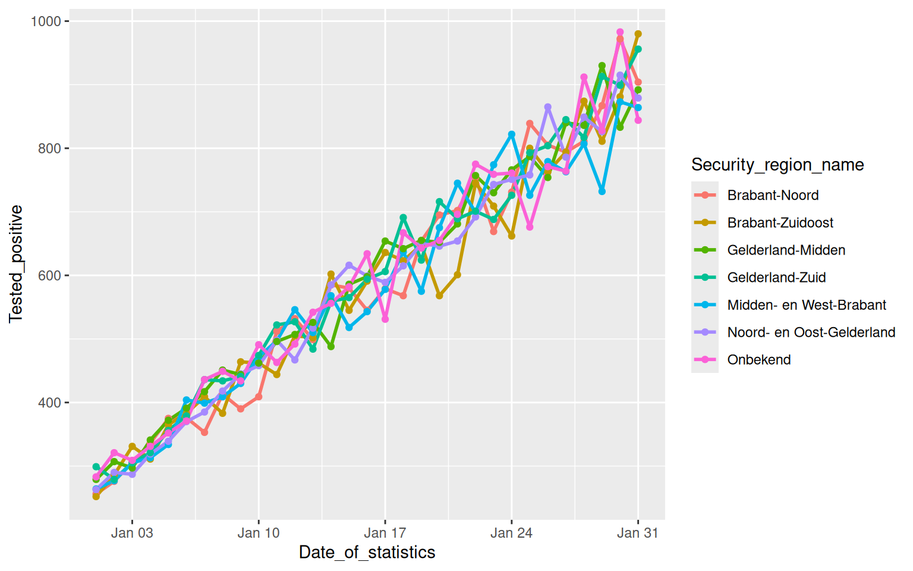
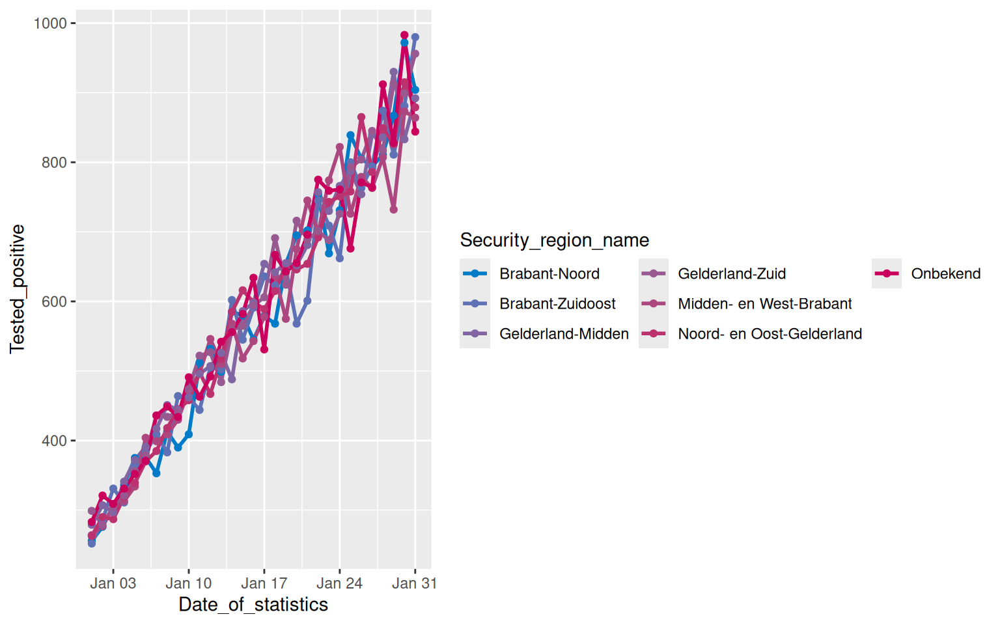
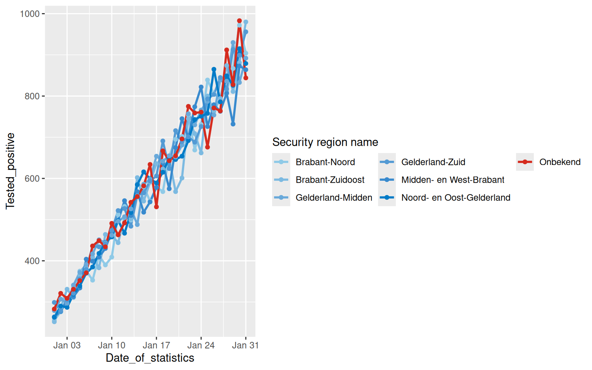

# Working with Color Palettes

In the [Getting started with ROvis vignette](getting-started-ROvis.md)
you learned how to explore colors and how to use the
[`ro_color()`](../reference/ro_color.md) function in your ggplots. You
also learned how to use the categorical color palette. However, ROvis
also has functions to create color sequences to help you with
visualizing ordinal and continuous data.

## Loading data

First, we need to load the required packages.

``` r

library(dplyr)
library(tidyr)
library(lubridate)
library(ggplot2)
library(ROvis.utils) # nolint: missing_package_linter
```

Second, we generate simulated data that mimics the structure of COVID-19
test data. We will use data for January 2022 for example graphs.

``` r

# Set seed for reproducibility
set.seed(123)

# Generate data for multiple regions used in the examples
dat_test_cov <- expand_grid(
  Date_of_statistics = seq(as_date("2022-01-01"), as_date("2022-01-31"), by = "day"),
  Security_region_name = c(
    "Brabant-Noord",
    "Brabant-Zuidoost",
    "Midden- en West-Brabant",
    "Noord- en Oost-Gelderland",
    "Gelderland-Midden",
    "Gelderland-Zuid",
    "Onbekend"
  )
) |>
  mutate(
    # Calculate day number (1-31) for upward trend
    day_num = as.numeric(Date_of_statistics - as_date("2022-01-01")) + 1,
    # Generate test numbers with slight variation
    Tested_with_result = as.integer(round(rnorm(n(), mean = 1800, sd = 50))),
    # Positive tests with steep upward trend: start at ~15% and increase to ~50%
    positive_rate = 0.15 + (day_num - 1) * (0.50 - 0.15) / 30,
    Tested_positive = as.integer(round(
      Tested_with_result * positive_rate * rnorm(n(), mean = 1, sd = 0.05)
    ))
  ) |>
  select(Date_of_statistics, Security_region_name, Tested_positive) |>
  mutate(Security_region_name = factor(Security_region_name)) |>
  as_tibble()
```

The first 5 rows look like this:

``` r

dat_test_cov |>
  head(5)
```

    # A tibble: 5 × 3
      Date_of_statistics Security_region_name      Tested_positive
      <date>             <fct>                               <int>
    1 2022-01-01         Brabant-Noord                         256
    2 2022-01-01         Brabant-Zuidoost                      252
    3 2022-01-01         Midden- en West-Brabant               264
    4 2022-01-01         Noord- en Oost-Gelderland             263
    5 2022-01-01         Gelderland-Midden                     279

## Coloring ordinal data

### Create a color sequence

Using a color sequence can be useful for coloring ordinal data. We can
use the `ro_color_seq` function to create a color sequence. Let’s create
a sequence from light to dark ‘hemelblauw’:

``` r

ro_color_seq(ro_color("hemelblauw_tint15"), ro_color("hemelblauw"), 5)
```

    [1] "#D9EBF7" "#B2CEEB" "#89B1DF" "#5B95D3" "#007BC7"

We can visually inspect our sequence with `show_colors`:

``` r

ro_show_colors(
  "custom",
  ro_color_seq(ro_color("hemelblauw_tint15"), ro_color("hemelblauw"), 5)
)
```

We can also create a color sequence from one color flowing into another
color. For example start with ‘robijnrood’ and end with ‘hemelblauw’:

``` r

ro_color_seq(ro_color("hemelblauw"), ro_color("robijnrood"), 8)
```

    [1] "#007BC7" "#5772B7" "#7869A7" "#8F5E98" "#A15189" "#B1427A" "#BE2E6B"
    [8] "#CA005D"

We can visually inspect our sequence with `show_colors`:

``` r

ro_show_colors(
  "custom",
  ro_color_seq(ro_color("hemelblauw"), ro_color("robijnrood"), 8)
)
```

### How to use `ro_color_seq()` in `ggplot` functions

To demonstrate the use of a color sequence in a ggplot graph, we select
the security regions in “Brabant” using `filter`. We start by creating a
plot without specifying colors. Thus, the resulting plot shows standard
colors of `ggplot`.

*(Please note: for the sake of this example, categorical data is used.
However, color gradients are especially powerful in visualizations of
ordinal or continuous data).*

``` r

tab_brab_geld <- dat_test_cov |>
  filter(
    Security_region_name %in%
      c(
        "Midden- en West-Brabant",
        "Brabant-Noord",
        "Brabant-Zuidoost",
        "Noord- en Oost-Gelderland",
        "Gelderland-Midden",
        "Gelderland-Zuid",
        "Onbekend"
      )
  ) |>
  # For the sake of the example, other levels get dropped from `Security_region_name`.
  mutate(Security_region_name = droplevels(Security_region_name))
```

``` r

fig_brab_geld <- tab_brab_geld |>
  ggplot(aes(
    x = Date_of_statistics,
    y = Tested_positive,
    color = Security_region_name
  )) +
  geom_line(linewidth = 1) +
  geom_point()

fig_brab_geld
```



We can apply the RIVM colors by using
[`ro_color_seq()`](../reference/ro_color_seq.md). We will also make the
legend items appear in three rows for readibility:

``` r

fig_brab_geld +
  scale_color_manual(
    values = c(ro_color_seq(ro_color("hemelblauw"), ro_color("robijnrood"), 7)),
    guide = guide_legend(nrow = 3)
  )
```



### How to use `ro_color_seq_named()` in `ggplot` functions

When including an explicit “Not available” category (e.g., “NA”), it can
be helpful to use the
[`ro_color_seq_named()`](../reference/ro_color_seq_named.md) function.
This function works similarly to
[`ro_color_seq()`](../reference/ro_color_seq.md), but it directly
assigns colors to the specified category names. This allows for more
precise control over color mapping in ordered visualizations.

``` r

tab_brab_geld |>
  ggplot(aes(
    x = Date_of_statistics,
    y = Tested_positive,
    color = Security_region_name
  )) +
  geom_line(linewidth = 1) +
  geom_point() +
  scale_color_manual(
    name = "Security region name",
    values = ro_color_seq_named(
      cat_names = levels(tab_brab_geld$Security_region_name),
      low_col = "lichtblauw",
      high_col = "hemelblauw",
      NA_cat_name = "Onbekend",
      NA_cat_col = "rood"
    ),
    guide = guide_legend(nrow = 3)
  )
```


